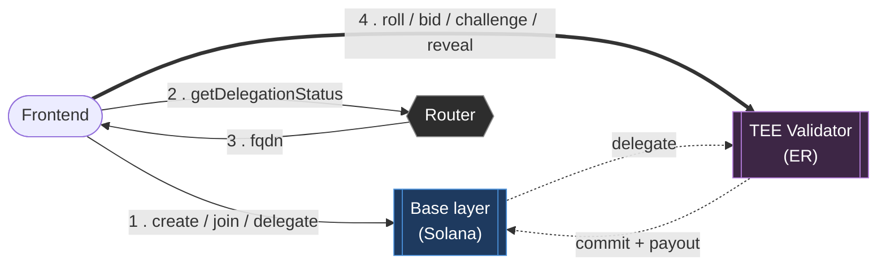
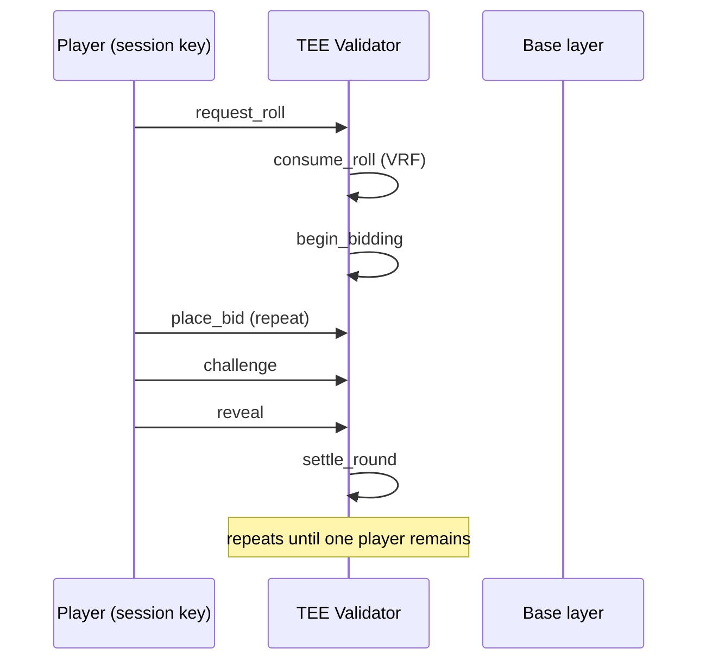
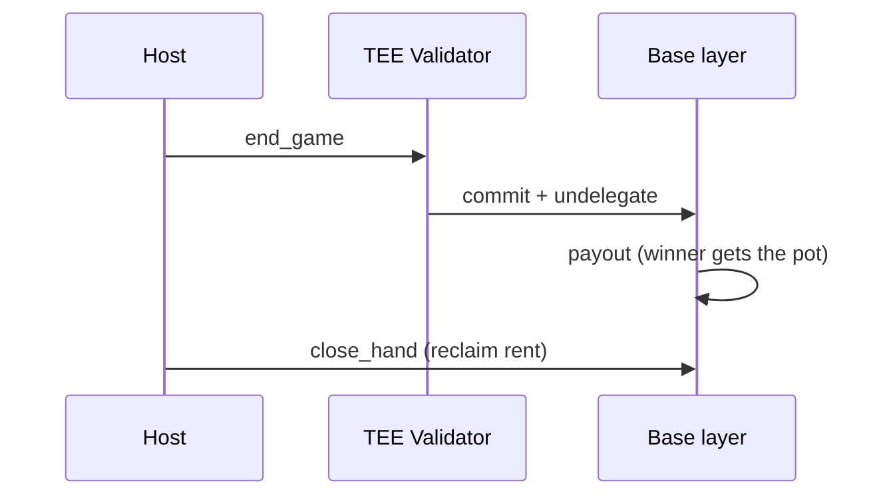

# Architecture

Liar's Dice is an Anchor program on Solana devnet. It uses MagicBlock
Ephemeral Rollups (ER) so gameplay (roll, bid, challenge, reveal) feels
instant, while game setup and the final payout settle on Solana itself.

## Program ID

```
1iAR1JYBJsjtzS6jSLbUfVbYuBfR88FpxbNPKUE6nLb
```

## The three pieces

| Piece | Endpoint | Role |
|---|---|---|
| **Base layer** | Solana devnet | create, join, delegate, payout |
| **Router** | `devnet-router.magicblock.app` | one-shot lookup: `getDelegationStatus` → validator `fqdn` |
| **ER / TEE validator** | `devnet-tee.magicblock.app` | roll, bid, challenge, reveal |

Router is not on the gameplay path — queried once, cached, then every
gameplay tx goes straight to the resolved `fqdn`.



## PER (private hands)

Standard ER + a `Permission` PDA per hand, gating reads on the TEE validator.

- `init_hand_permission` — 2 members: wallet + session key. Only reader set.
- Lazy: created on first roll/bid, not at join — join stays fast.
- Reads require an auth token: sign a message → trade for token → attach to request.

## Cleanup

| Account | Closed? | How |
|---|---|---|
| `PlayerHand` | Yes | `close_hand`, after `Ended` + undelegated, rent → player |
| `Permission` PDA | Yes | `close_hand_permission`, session-signed, on the ER, rent → hand PDA |
| Session keypair | No | only replaced on expiry (`isRefresh` path, `enter.ts`), never revoked at game end |

`close_hand_permission` must run **before** `end_game` undelegates the hand —
once the hand leaves the ER, the permission PDA is unreachable and its rent
is stuck for good. Two call sites in `GameTable.tsx`:

- **Eliminated players** — `settle()` checks if the local seat just lost its
  last die and, if so, closes its own permission immediately.
- **The winner** — `payout()` closes its own permission right before firing
  `end_game`.


## Session keys

One wallet approval at join creates a session keypair + on-chain token.
Every roll/bid/challenge/reveal after that signs with the session key —
no wallet popup per move.

## Round flow



## Ending the game

When one player remains, the host sends `end_game`. This is a **Magic
Action**: one instruction that commits the ER state back to Solana,
undelegates the accounts, and pays out the winner — all atomically, so the
payout always reads the final, authoritative state.



## Instructions

| Instruction | Runs on | Purpose |
|---|---|---|
| `create_game` | Base | Host creates the game |
| `join_game` | Base | Player joins |
| `delegate_hand` / `delegate_game` | Base | Hand over accounts to the ER |
| `start_game` | Base | Host starts the round loop |
| `init_hand_permission` | ER | Make a hand private (session-signed) |
| `close_hand_permission` | ER | Reclaim permission rent, before undelegation (session-signed) |
| `request_roll` / `consume_roll` | ER | Roll the dice (VRF) |
| `place_bid` | ER | Submit a bid |
| `challenge` | ER | Call "Liar!" (session-signed) |
| `reveal` | ER | Reveal a hand (session-signed) |
| `settle_round` | ER | Score the round |
| `force_timeout` | ER | Evict a stalled player (session-signed) |
| `cancel_game` | Base | Cancel before start |
| `end_game` | ER | Commit + undelegate + payout (Magic Action) |
| `payout` | Base | Pays the pot to the winner |
| `close_hand` | Base | Reclaim hand rent |

## Frontend files

- `app/src/chain/connection.ts` — base, router, TEE, and session connections
- `app/src/chain/enter.ts` — bundles join + delegate + session setup into one wallet tx
- `app/src/chain/delegation.ts` — asks the router where a game lives
- `app/src/chain/sendSession.ts` / `sendWallet.ts` — send session-signed vs wallet-signed txs
- `app/src/chain/pdas.ts` — PDA derivation
- `app/src/screens/` — one screen per route

## Config

- Cluster: `devnet`
- Router: `https://devnet-router.magicblock.app/`
- TEE validator: `https://devnet-tee.magicblock.app`
- PDA seeds: `game`, `hand`, `vault`, `identity`
