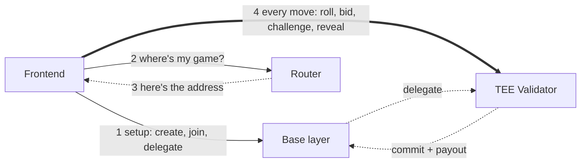
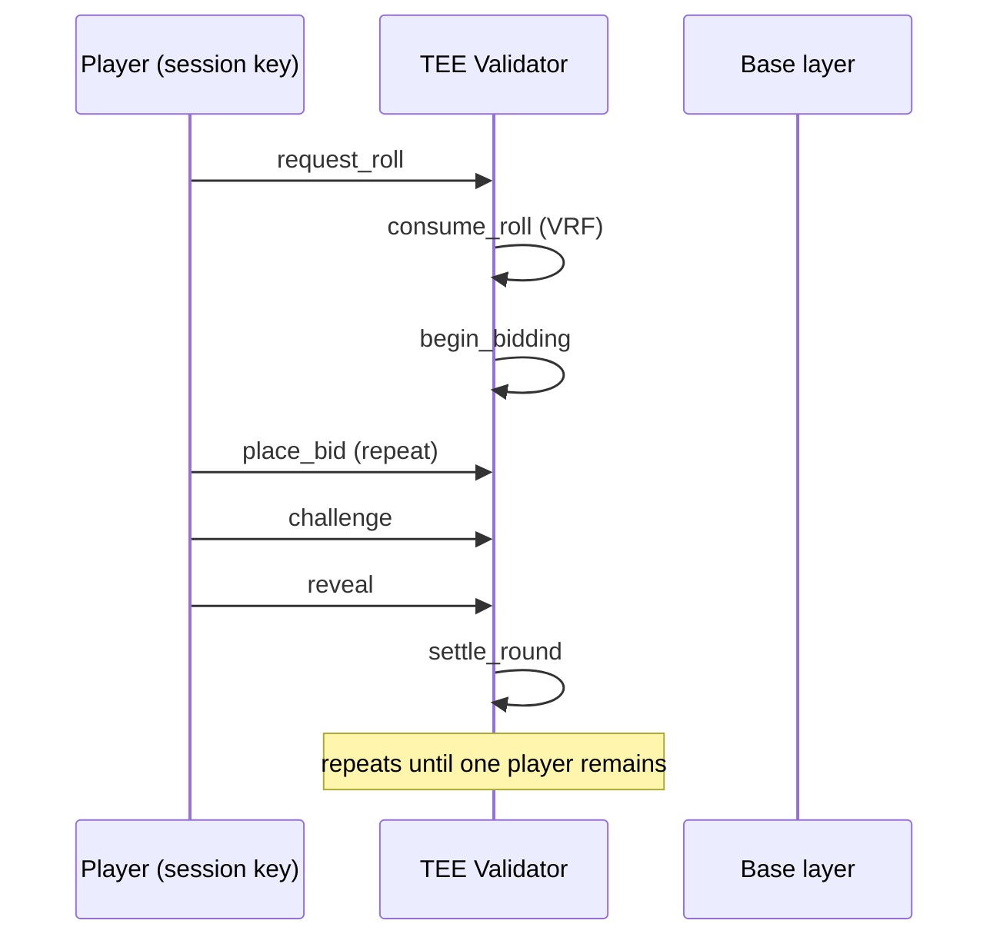
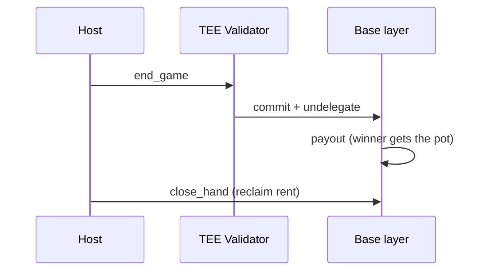

# Architecture

Liar's Dice is an Anchor program on Solana devnet. It uses MagicBlock
Ephemeral Rollups (ER) so gameplay (roll, bid, challenge, reveal) feels
instant, while game setup and the final payout settle on Solana itself.

## Program ID

```
LiardgANuvDi5koHS7eAX9AB9egH2STFLyD8sbBueNL
```

## The three pieces

| Piece | What it is | What happens there |
|---|---|---|
| **Base layer** | Solana devnet | Create game, join, delegate, payout |
| **Router** | `devnet-router.magicblock.app` | Answers one question: "which validator has my game right now?" |
| **ER / TEE validator** | `devnet-tee.magicblock.app` | Every dice roll, bid, challenge, reveal |

The router is **not** in the gameplay path. The client asks it once
("where's my game?"), gets back an address, and then talks to that address
directly for every gameplay move. Think of the router as a phone book, not a
switchboard.



## Why it's private (PER)

This isn't a plain ER — it's a **Private Ephemeral Rollup**. Each player's
dice live behind a `Permission` account on the validator, so nobody but the
player (and their session key) can read their own hand. Without this, any
player could peek at everyone's dice mid-game.

- `init_hand_permission` creates that permission, listing the wallet + the
  session key as the only two readers.
- It's created lazily — on the player's very first roll or bid, not at
  join — so joining a table stays instant no matter how many players.
- Reading a private hand requires proving you're one of those two readers:
  sign a message, trade it for a short-lived token, attach the token to the
  request.

## Cleanup: what gets closed, what doesn't

- **`PlayerHand`** — closed. `close_hand` reclaims its rent back to the
  player, once the game has `Ended` and the hand is back on base layer.
- **`Permission` PDA** — **not closed.** It lives on the ER and there's no
  instruction that closes it. It's dead weight after the game ends (until
  the ER validator's own state eventually cycles), but nothing reclaims its
  rent today.
- **Session keypair** — **not revoked** at game end either. It's only
  revoked when a *new* one is about to replace an *expired* one (the
  `isRefresh` path in `enter.ts`). A session key from a finished game just
  sits unused until its on-chain token expires on its own.

Neither is a security hole — a stale permission or an expired session key
can't be used against you — but if you care about rent, both are currently
one-way: created, never reclaimed.

## Why session keys (no wallet popups mid-game)

A player approves once with their wallet at join time. That approval creates
a **session key** — a throwaway keypair the app generates locally, backed by
an on-chain token. From then on, every roll/bid/challenge/reveal is signed
by that session key instead of the wallet, so there's no popup on every
single move.

## Round flow



## Ending the game

When one player remains, the host sends `end_game`. This is a **Magic
Action**: one instruction that commits the ER state back to Solana,
undelegates the accounts, and pays out the winner — all atomically, so the
payout always reads the final, authoritative state.



## Instructions

| Instruction | Runs on | Purpose |
|---|---|---|
| `create_game` | Base | Host creates the game |
| `join_game` | Base | Player joins |
| `delegate_hand` / `delegate_game` | Base | Hand over accounts to the ER |
| `start_game` | Base | Host starts the round loop |
| `init_hand_permission` | ER | Make a hand private (session-signed) |
| `request_roll` / `consume_roll` | ER | Roll the dice (VRF) |
| `place_bid` | ER | Submit a bid |
| `challenge` | ER | Call "Liar!" (session-signed) |
| `reveal` | ER | Reveal a hand (session-signed) |
| `settle_round` | ER | Score the round |
| `force_timeout` | ER | Evict a stalled player (session-signed) |
| `cancel_game` | Base | Cancel before start |
| `end_game` | ER | Commit + undelegate + payout (Magic Action) |
| `payout` | Base | Pays the pot to the winner |
| `close_hand` | Base | Reclaim hand rent |

## Frontend files

- `app/src/chain/connection.ts` — base, router, TEE, and session connections
- `app/src/chain/enter.ts` — bundles join + delegate + session setup into one wallet tx
- `app/src/chain/delegation.ts` — asks the router where a game lives
- `app/src/chain/sendSession.ts` / `sendWallet.ts` — send session-signed vs wallet-signed txs
- `app/src/chain/pdas.ts` — PDA derivation
- `app/src/screens/` — one screen per route

## Config

- Cluster: `devnet`
- Router: `https://devnet-router.magicblock.app/`
- TEE validator: `https://devnet-tee.magicblock.app`
- PDA seeds: `game`, `hand`, `vault`, `identity`
